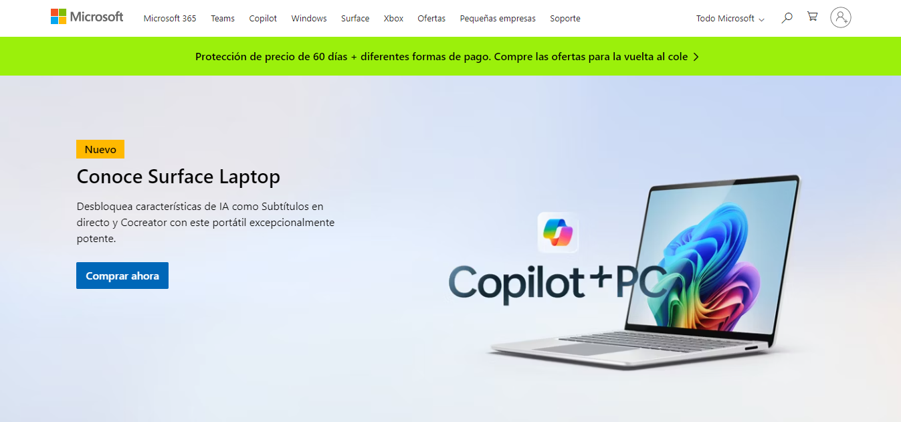
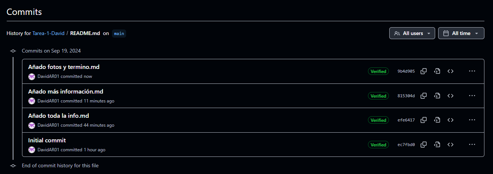

# ¿Qué es GitHub? 
## David Albareda Rodríguez

**Github** es un portal creado para alojar el código de las aplicaciones de cualquier desarrollador,
y que fue comprada por **Microsoft** en junio del 2018.
La plataforma está creada para que los desarrolladores suban el código de:
- Aplicaciones 
- Herramientas

Como usuario no sólo puedes descargar la aplicación,
sino también entrar a su perfil para leer sobre ella o colaborar con su desarrollo.

**Copilot** es un sistema de inteligencia artificial creado por **Microsoft**.

Es lo que se llama un *sistema conversacional*,
lo que quiere decir que la manera de controlarlo e interactuar con esta IA es a través de un chat.

**¿Cómo añadir una segunda cuenta de correo?**

1. En la esquina superior derecha de cualquier página en GitHub, haga clic en la fotografía de perfil y luego en Configuración.
2. En la sección "Acceso" de la barra lateral, haz clic en  Correos electrónicos.
3. En "Agregar dirección de correo electrónico", escribe tu dirección de correo electrónico y haz clic en Agregar.
4. Comprueba la dirección de correo electrónico.
5. En el menú desplegable "Dirección de correo electrónico principal", selecciona la dirección que quieres asociar con tus operaciones de Git basadas en web.

**¿Cómo asignar la segunda cuenta de correo como principal?**

1. Abrir GitHub e iniciar sesión.
2. Pinchar arriba a la derecha (donde aparece tu foto), y buscar "Settings" en la lista.
3. Entrar en "Settings".
4. Buscar en la lista que aparece en la parte izquierda el apartado de "Emails".
5. Una vez dentro de "Emails", buscar "Primary email adreess".
6. Elegir en el menu desplegable la cuenta de correo que quieras asignar como principal.

**A continuación adjunto foto de los commits:**

## FIN
